Elian BOAGLIO  
Sophie LARGE  
_5 SDBD B1_

# Clustering

## K-means

### Principe de la méthode

La méthode k-means est une méthode de partionnement qui a pour objectif de minimiser la distance intra-cluster.
Cette méthode permet de partager un ensemble de points en un nombre donnée de clusters (k). Chaque cluster sera par la suite représenter par un unique point. Cette méthode s'appuie sur l'algothime de Lloyd.

Il existe plusieurs déclinaisons de cette méthode :

- **k-means random** : Ses centres ne sont pas forcément des points appartenant au jeu de données.
- **k-means++** : On initialise de manière plus intelligente, c'est-à-dire que les centres initiaux sont choisis ded façon optimale.
- **mini-batch** : Cette méthode est destinée aux jeux de données avec un grand nombre de points. Elle séquence les points en plus petits lots pour ensuite calculer les centres de manière plus optimale.
- **k-medoids** : Elle repose sur l'algorithme "Permutation Around Medoids". Son objectif est de minimiser la somme des erreurs absolues aux k medoïds. Les centres finaux des clusters correspondent à des points du jeu de données.

### Étape de la méthode

1. **Initialisation** : Positionne les centres initiaux des k clusters, soit avec la méthode "k-means++" soit avec celle "random".
2. **Création de groupes** : Pour chaque point du jeu de données, l'algorithme l'affecte à un des clusters créés précédemment.
3. **Mise à jour** : On recalcule les centres de chaque cluster.
4. **Attente qu'une condition d'arrêt soit complétée**

### Hyperparamètres

- **n_clusters ou k** :
  C'est le nombre de cluster que l'on veut.
- **init** :
  Ce paramètre permet de choisir la méthode d'initalisation des centroïdes.
  Ses valeurs possibles sont :
  - _random_ : choisit aléatoirement les centres initiaux. Cette méthode est plus rapide mais moins fiable.
  - _k-means++ (par défaut)_ : calcule en amont les écarts entre chaque centre inital pour les placer de manière optimale.
- **n_init** :
  Cela correspond au nombre de graines aléatoires pour l'initialisation.
- **max_iter** :
  Avec ce paramètre, nous pouvons limiter le nombre d'itérations de notre recherche. Il permet d'éviter les boucles infinis.
- **tol** :
  C'est une condition d'arrêt qui repose sur la stabilisation des centres, c'est-à-dire que l'algorithme s'arrête lorsque les centres ne bougent presque plus.
- **algorithm** :
  Ici nous choississons l'algorithme qui réalisera le clustering. Par défaut, l'algorithme choisi est celui de Lloyd.

### Hyperparamètres testés

Nous avons choisi de faire varier 3 paramètres : **k**, **init** et **max_iter**.  
Pour cela nous avons étudié 3 datasets différents : spherical_6_2, R15 et diamond9.
Ces 3 jeux de points ont des caractéristiques similaires. En effet, ils ont très peu de bruits et les clusters sont symétriques et distincts.

#### Spherical_6_2

_CONFIGURATION OPTIMALE_

- _n_init_ : 10
- _random_state_ : 42
- _n_clusters_ : 6
- _max_iter_ : 1

| Init      | Silhouette | Calinski-Harabasz | Davies-Bouldin | Score combiné |
| :-------- | ---------: | ----------------: | -------------: | ------------: |
| k-means++ |      0.748 |           2713.65 |          0.355 |         1.544 |
| random    |      0.397 |           154.076 |          0.945 |          0.39 |

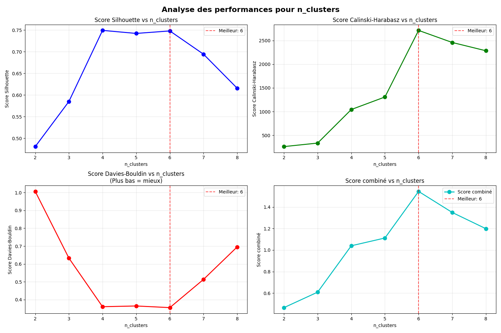
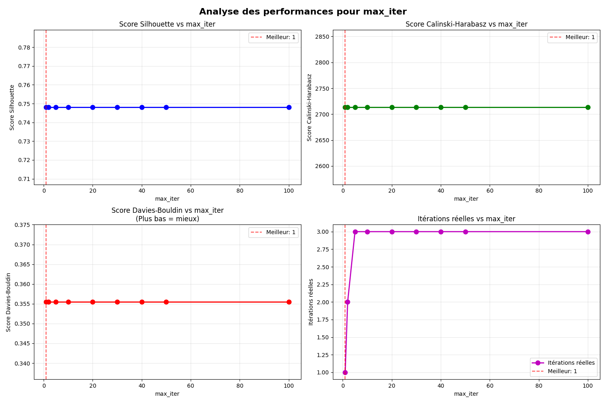
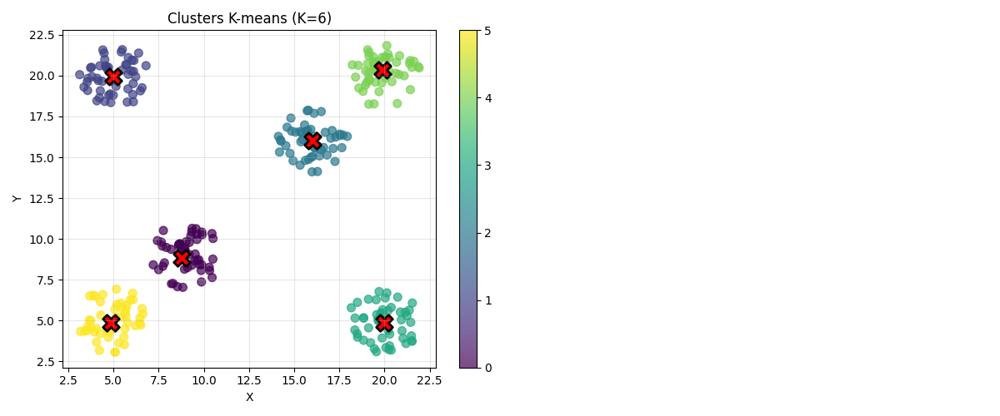

#### R15

_CONFIGURATION OPTIMALE_

- _n_init_ : 10
- _random_state_ : 42
- _n_clusters_ : 15
- _max_iter_ : 2

| Init      | Silhouette | Calinski-Harabasz | Davies-Bouldin | Score combiné |
| :-------- | ---------: | ----------------: | -------------: | ------------: |
| k-means++ |      0.753 |           4871.98 |          0.315 |         2.231 |
| random    |      0.537 |           1849.48 |          0.742 |         1.012 |

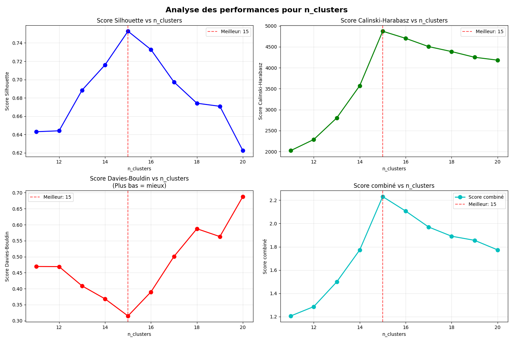
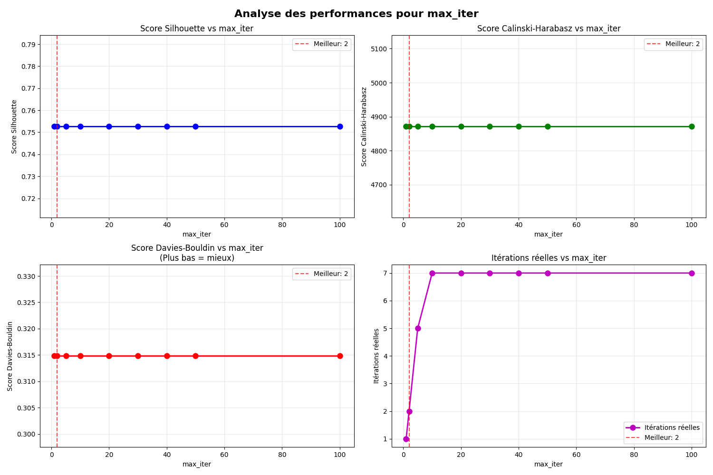
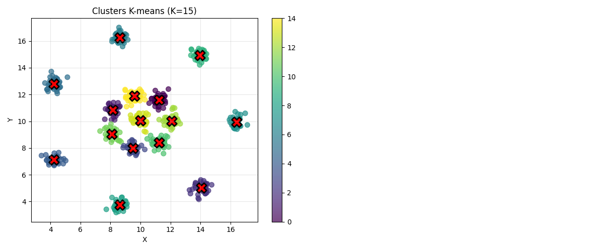

#### Diamond9

_CONFIGURATION OPTIMALE_

- _n_init_ : 10
- _random_state_ : 42
- _n_clusters_ : 9
- _max_iter_ : 2

| Init      | Silhouette | Calinski-Harabasz | Davies-Bouldin | Score combiné |
| :-------- | ---------: | ----------------: | -------------: | ------------: |
| k-means++ |      0.549 |           5855.15 |          0.553 |         2.267 |
| random    |      0.461 |           3930.13 |          0.753 |         1.589 |

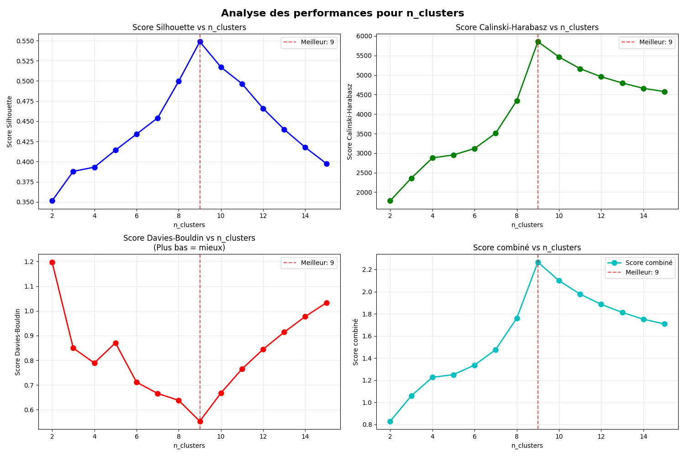
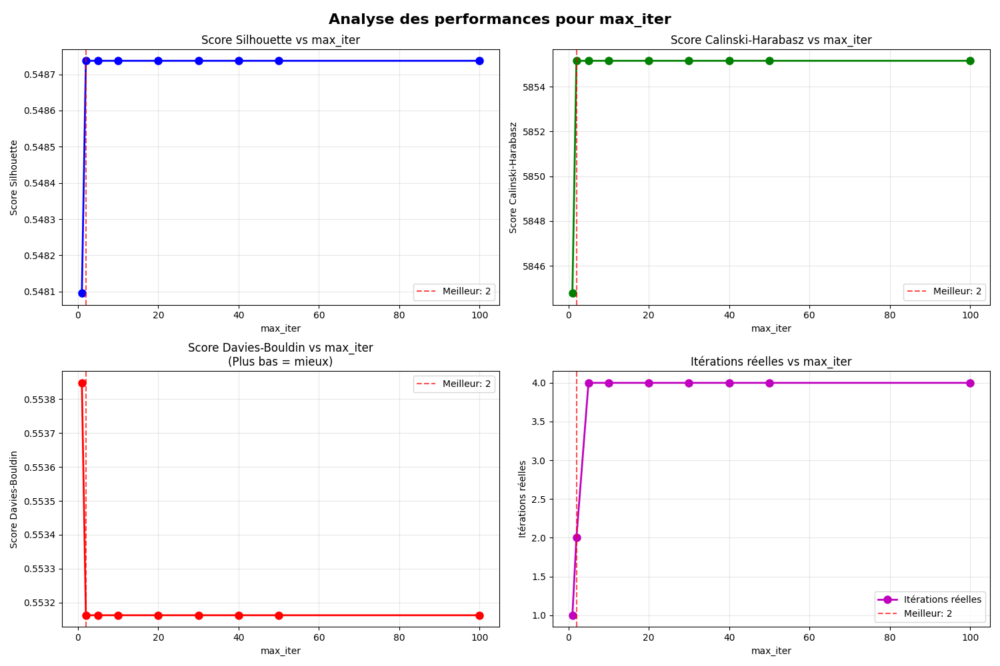
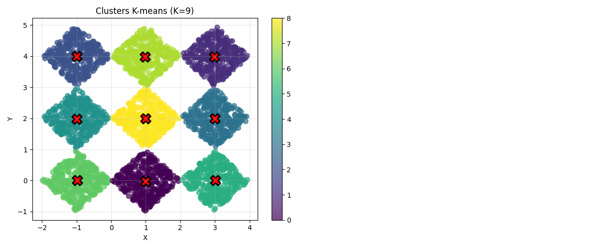

### Faiblesse

Nous avons fait des tests avec des jeux de points aux caractéristes éloignés des 3 premires. En effet, les jeux _dpb_ et _cluto-t4-8k_ ont pas du bruit, ce qui rend les clusters moins repérables. De plus, les clusters ne sont plus en forme de bulle, ce qui mets à mal notre algorithme.

#### dpb

_CONFIGURATION OPTIMALE_

- _n_init_ : 10
- _random_state_ : 42
- _n_clusters_ : 8
- _max_iter_ : 20

| Init      | Silhouette | Calinski-Harabasz | Davies-Bouldin | Score combiné |
| :-------- | ---------: | ----------------: | -------------: | ------------: |
| k-means++ |      0.463 |              4296 |          0.682 |         1.713 |
| random    |      0.443 |           3797.34 |          0.691 |          1.55 |

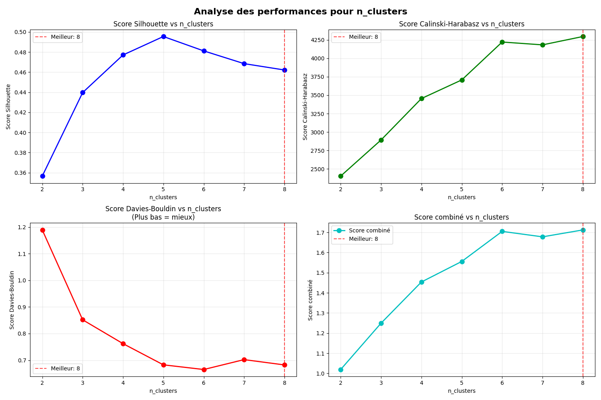
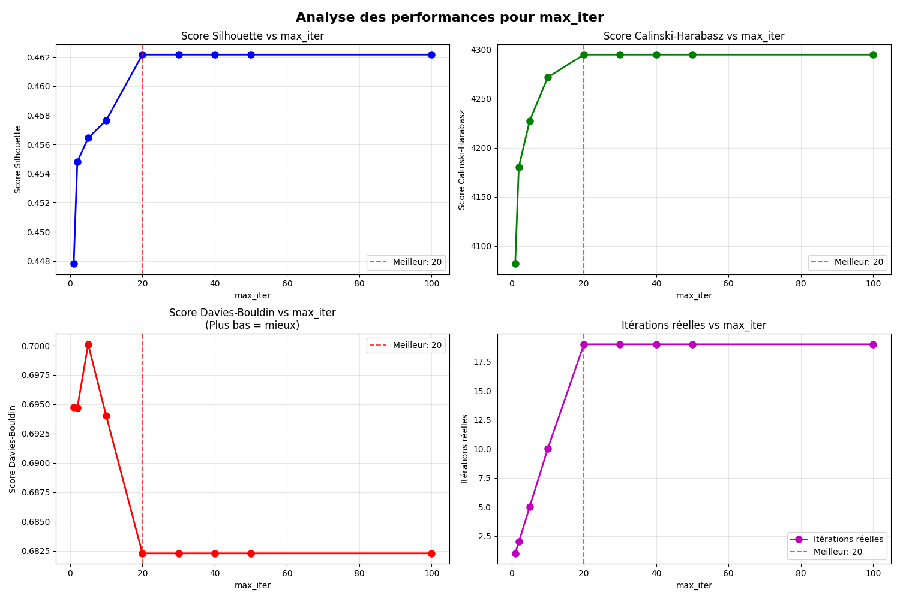
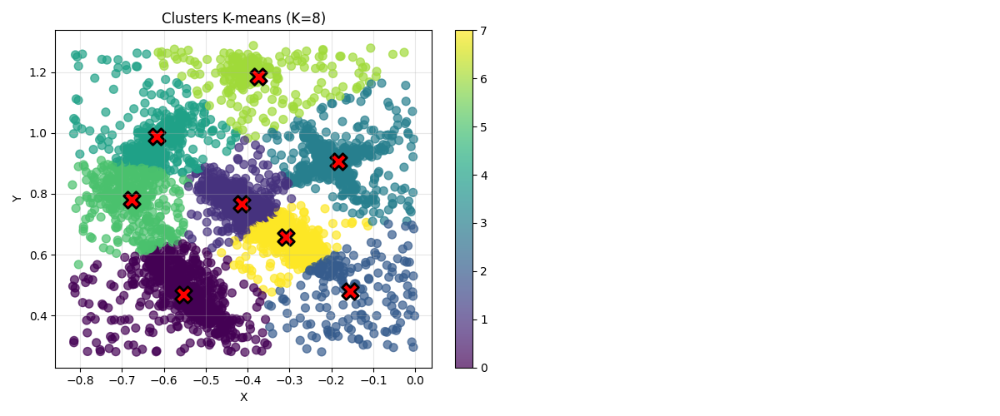

En réalité, nous aurions dû trouver 5 clusters.

#### cluto-t4-8k

_CONFIGURATION OPTIMALE_

- _n_init_ : 10
- _random_state_ : 42
- _n_clusters_ : 2
- _max_iter_ : 5

| Init      | Silhouette | Calinski-Harabasz | Davies-Bouldin | Score combiné |
| :-------- | ---------: | ----------------: | -------------: | ------------: |
| k-means++ |      0.507 |           13050.2 |          0.738 |         4.355 |
| random    |      0.507 |           13050.2 |          0.738 |         4.355 |

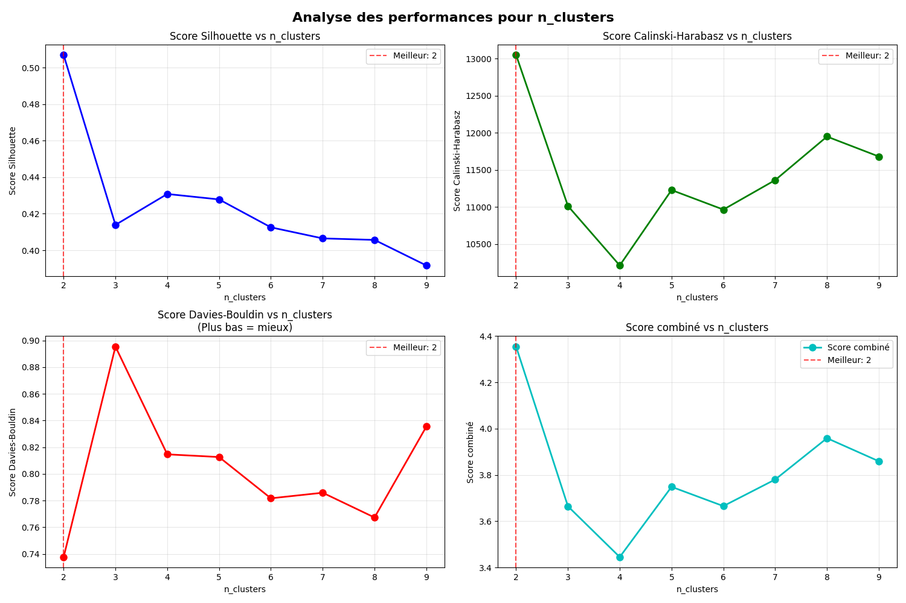
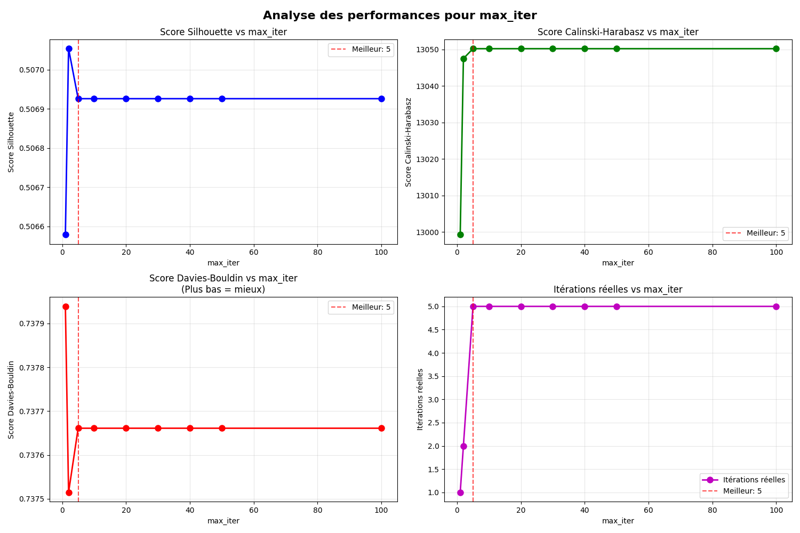
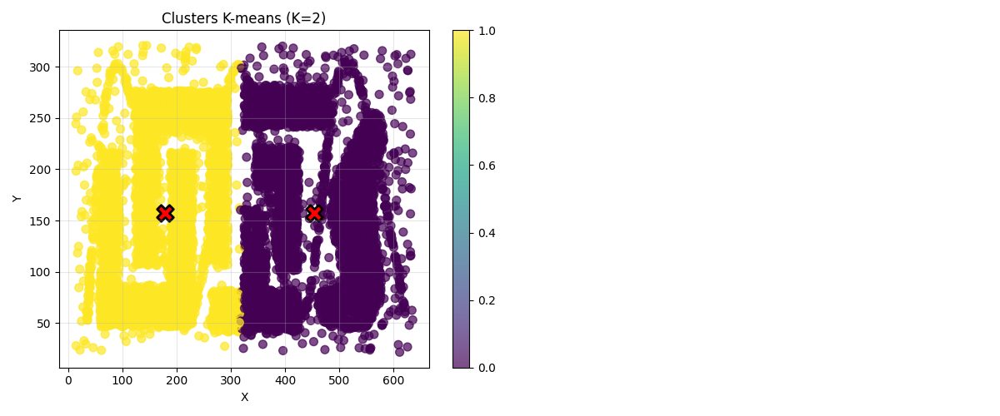

En réalité, nosu aurions du trouvé 6 clusters.

## Agglomératif : Cluserting Ascendant

### Principe

Initialement, chaque point est un cluster. Ensuite on essaie de les regrouper selon leur ressemblace, avec des calcul de similarité. On effectue des fuciosn jusqu'à n'avoir plus qu'un seul cluster.  
Cette méthode se différencie des clusterings descendants qui prennent initialement un seul culster et cherchent à avoir autant de clusters que de points.
